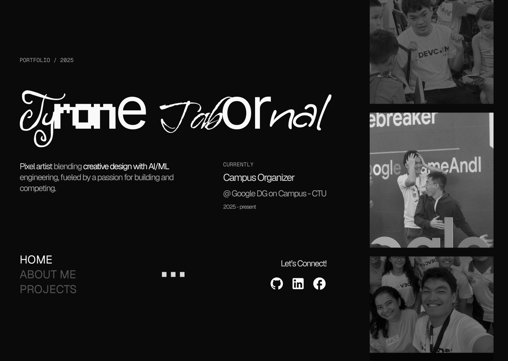

# Minimalist Portfolio

A clean, minimalist portfolio website built with HTML and CSS, featuring a sleek dark theme and responsive design.

## Overview

This project is a personal portfolio website for Tyrone Tabornal, showcasing his work as a pixel artist, UX/UI designer, and aspiring AI/ML engineer. The design follows minimalist principles with a focus on typography, clean layout, and subtle animations.

## Features

- Responsive design that works on desktop and mobile devices
- Dark theme with high contrast for better readability
- Custom typography using Geist and Geist Mono fonts
- Separate pages for Home and About sections
- Social media integration with GitHub, LinkedIn, and Facebook links
- Clean, minimalist aesthetic with careful attention to spacing and layout

## Screenshots

### Home Page


## Technologies Used

- HTML5
- CSS3
- Custom fonts (Geist and Geist Mono)
- Responsive design techniques

## Setup and Installation

1. Clone the repository:

   ```bash
   git clone https://github.com/Nesqyk/minimalist-portfolio.git
   ```

2. Open the project in your preferred code editor

3. View the website by opening `index.html` in your browser

## Project Structure

```text
minimalist-portfolio/
├── fonts/
│   ├── Geist-Regular.ttf
│   └── GeistMono-Regular.ttf
├── images/
│   ├── icons/
│   │   ├── ic_baseline-facebook.svg
│   │   ├── mdi_github.svg
│   │   └── mdi_linkedin.svg
│   ├── image_1_home.png
│   ├── image_2_home.png
│   ├── image_3_home.png
│   ├── image_4_about.png
│   └── Tyrone Tabornal - logo.png
├── index.html
├── about.html
├── styles.css
├── LICENSE
└── README.md
```

## License

This project is licensed under the GNU General Public License v3.0 - see the [LICENSE](LICENSE) file for details.

## Author

- **Tyrone Tabornal** - [GitHub](https://github.com/Nesqyk) | [LinkedIn](https://www.linkedin.com/in/tyrone-tabornal-738984274/)